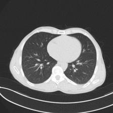

# Transcending Grids: Point Clouds and Surface Representations Powering Neurological Processing
This repository contains the code for the paper

**[[2305.15426] Transcending Grids: Point Clouds and Surface Representations Powering Neurological Processing][1]**  
[Vivek Narayan Uppala][vu], [Nampalle Kishore Babu][nkb], [Pradeep Singh][ps], Sumit Gangwar, Rajesh Singh Negi, [Balasubramanian Raman][br] 

<div align="center">
  
</div>

## Introduction
In healthcare, accurately classifying medical images is vital, but conventional methods often hinge on medical data with a consistent grid structure, which may restrict their overall performance. Recent medical research has been focused on tweaking the architectures to attain better performance without giving due consideration to the representation of data. In this paper, we present a novel approach for transforming grid based data into its higher dimensional representations, leveraging unstructured point cloud data structures. We first generate a sparse point cloud from an image by integrating pixel color information as spatial coordinates. Next, we construct a hypersurface composed of points based on the image dimensions, with each smooth section within this hypersurface symbolizing a specific pixel location. Polygonal face construction is achieved using an adjacency tensor. Finally, a dense point cloud is generated by densely sampling the constructed hypersurface, with a focus on regions of higher detail. The effectiveness of our approach is demonstrated on a publicly accessible brain tumor dataset, achieving significant improvements over existing classification techniques. This methodology allows the extraction of intricate details from the original image, opening up new possibilities for advanced image analysis and processing tasks.

## Visualization
The hyperplanes, point clouds along with the original image for various strategies are shown below:
<div align="center">
  
</div>
For further clarity and help in visualization, we have provided an example image, it's mesh and it's corresponding point cloud generated from two different views.

<div align="center">
  
</div>
The mesh can be checked out [here][https://sketchfab.com/3d-models/your-mesh-d0020c78213a415c90660398b2fdd69f].
View of point cloud from 80 degrees:

Side view of point cloud:


## Installation
Clone this repository:
```
git clone git@github.com:Uviveknarayan/Transcending_Grids.git
```

## Running Experiments and Workflow
We provide code to reproduce the main results in Jupyter Notebook files.
```
1. Run the OFFconversion file with chosen strategy(Triangle or Square) for an image dataset.
2. Use the obtained OFF files as dataset to run the jupyter notebooks and obtain results.
```
<div align="center">
  
</div>

## Citation and Acknowledgement
If you find our work useful in your research, please cite:

```
@article{nampalle2023transcending,
  title={Transcending Grids: Point Clouds and Surface Representations Powering Neurological Processing},
  author={Nampalle, Kishore Babu and Singh, Pradeep and Uppala, Vivek Narayan and Gangwar, Sumit and Negi, Rajesh Singh and Raman, Balasubramanian},
  journal={arXiv preprint arXiv:2305.15426},
  year={2023}
}
```


[1]: https://arxiv.org/abs/2305.15426
[vu]: https://scholar.google.com/citations?user=x-eWnIoAAAAJ
[nkb]: https://scholar.google.com/citations?hl=en&user=VUdmmBAAAAAJ
[ps]: https://scholar.google.com/citations?hl=en&user=aX8yaSQAAAAJ
[br]: https://scholar.google.com/citations?hl=en&user=QU2O6JMAAAAJ 
